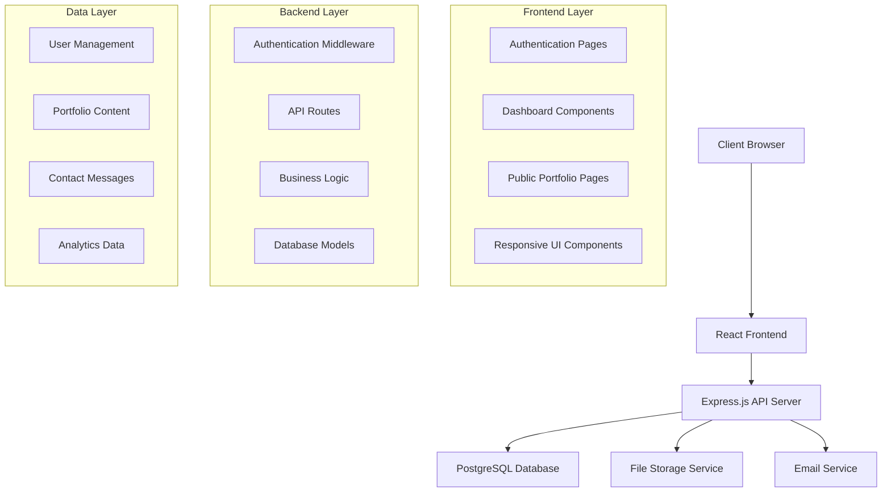

# FreelanceForge Design Document

## Overview

FreelanceForge is a full-stack web application that enables freelancers to create and manage professional portfolio websites. The system follows a modern web architecture with a React frontend, Node.js/Express backend, and PostgreSQL database. The application emphasizes clean design, mobile responsiveness, and user experience optimization.

## Architecture

### System Architecture



### Technology Stack

**Frontend:**
- React 18 with TypeScript
- React Router for navigation
- Tailwind CSS for styling
- React Hook Form for form management
- Axios for API communication
- React Query for state management and caching

**Backend:**
- Node.js with Express.js
- TypeScript for type safety
- JWT for authentication
- bcrypt for password hashing
- Multer for file uploads
- Nodemailer for email notifications
- express-rate-limit for API protection

**Database:**
- PostgreSQL for primary data storage
- Prisma ORM for database management
- Redis for session storage and caching

**Infrastructure:**
- Cloud storage (AWS S3 or similar) for images
- Email service (SendGrid or similar)
- Environment-based configuration

## Components and Interfaces

### Frontend Components

#### Authentication Components
- `LoginForm`: Handles user login with validation
- `SignupForm`: Manages user registration
- `AuthGuard`: Protects authenticated routes
- `PublicRoute`: Handles public access routes

#### Dashboard Components
- `DashboardLayout`: Main dashboard container
- `ProfileEditor`: Profile information management
- `ProjectManager`: CRUD operations for projects
- `SkillsEditor`: Skills management interface
- `ExperienceManager`: Work history and education
- `ContactMessages`: Displays received messages
- `ThemeSelector`: Theme customization controls
- `Analytics`: Portfolio view statistics

#### Public Portfolio Components
- `PortfolioLayout`: Public portfolio container
- `ProfileHeader`: User profile display
- `ProjectShowcase`: Projects grid/list display
- `SkillsDisplay`: Skills visualization
- `ExperienceTimeline`: Experience chronological display
- `ContactForm`: Visitor contact interface

#### Shared Components
- `ImageUpload`: Reusable image upload component
- `FormField`: Standardized form inputs
- `Modal`: Reusable modal dialogs
- `LoadingSpinner`: Loading state indicator
- `ErrorBoundary`: Error handling wrapper

### Backend API Interfaces

#### Authentication Endpoints
```typescript
POST /api/auth/register
POST /api/auth/login
POST /api/auth/logout
GET /api/auth/me
```

#### User Management Endpoints
```typescript
GET /api/users/profile
PUT /api/users/profile
POST /api/users/upload-avatar
DELETE /api/users/avatar
```

#### Portfolio Content Endpoints
```typescript
GET /api/projects
POST /api/projects
PUT /api/projects/:id
DELETE /api/projects/:id
POST /api/projects/:id/upload-image

GET /api/skills
PUT /api/skills
GET /api/experience
POST /api/experience
PUT /api/experience/:id
DELETE /api/experience/:id
```

#### Public Portfolio Endpoints
```typescript
GET /api/public/portfolio/:username
POST /api/public/contact/:username
GET /api/public/portfolio/:username/analytics (authenticated owner only)
```

#### Contact & Analytics Endpoints
```typescript
GET /api/messages
PUT /api/messages/:id/read
DELETE /api/messages/:id
GET /api/analytics/views
```

## Data Models

### User Model
```typescript
interface User {
  id: string;
  username: string; // unique, used in public URL
  email: string; // unique
  passwordHash: string;
  name?: string;
  jobTitle?: string;
  bio?: string;
  profilePicture?: string;
  theme: 'light' | 'dark';
  createdAt: Date;
  updatedAt: Date;
}
```

### Project Model
```typescript
interface Project {
  id: string;
  userId: string;
  title: string;
  description: string;
  image?: string;
  technologies: string[]; // JSON array
  projectUrl?: string;
  displayOrder: number;
  createdAt: Date;
  updatedAt: Date;
}
```

### Skill Model
```typescript
interface Skill {
  id: string;
  userId: string;
  name: string;
  type: 'text' | 'icon';
  iconUrl?: string; // for tech icons
  displayOrder: number;
  createdAt: Date;
}
```

### Experience Model
```typescript
interface Experience {
  id: string;
  userId: string;
  type: 'work' | 'education';
  title: string;
  description: string;
  startDate: Date;
  endDate?: Date; // null for current positions
  displayOrder: number;
  createdAt: Date;
  updatedAt: Date;
}
```

### Contact Message Model
```typescript
interface ContactMessage {
  id: string;
  portfolioUserId: string;
  senderName: string;
  senderEmail: string;
  message: string;
  isRead: boolean;
  createdAt: Date;
}
```

### Analytics Model
```typescript
interface PortfolioView {
  id: string;
  portfolioUserId: string;
  viewerIp: string; // hashed for privacy
  userAgent?: string;
  referrer?: string;
  viewedAt: Date;
}
```

## Error Handling

### Frontend Error Handling
- Global error boundary for React component errors
- API error interceptors with user-friendly messages
- Form validation with real-time feedback
- Network error handling with retry mechanisms
- 404 pages for invalid routes/usernames

### Backend Error Handling
- Centralized error middleware
- Structured error responses with consistent format
- Input validation using Joi or similar
- Database constraint error handling
- File upload error management
- Rate limiting with appropriate error messages

### Error Response Format
```typescript
interface ErrorResponse {
  success: false;
  error: {
    code: string;
    message: string;
    details?: any;
  };
  timestamp: string;
}
```

## Testing Strategy

### Frontend Testing
- Unit tests for utility functions and hooks
- Component testing with React Testing Library
- Integration tests for user flows
- Visual regression testing for UI components
- Accessibility testing with axe-core
- Mobile responsiveness testing

### Backend Testing
- Unit tests for business logic and utilities
- Integration tests for API endpoints
- Database integration tests
- Authentication and authorization tests
- File upload functionality tests
- Email service integration tests

### End-to-End Testing
- User registration and login flows
- Portfolio creation and editing workflows
- Public portfolio viewing and contact form
- Theme switching functionality
- Mobile device testing scenarios

### Test Data Management
- Database seeding for consistent test environments
- Mock data generators for various scenarios
- Test user accounts with different portfolio configurations
- Image upload testing with various file types and sizes

## Security Considerations

### Authentication & Authorization
- JWT tokens with appropriate expiration
- Password strength requirements
- Rate limiting on authentication endpoints
- CSRF protection for state-changing operations
- Secure session management

### Data Protection
- Input sanitization and validation
- SQL injection prevention through ORM
- XSS protection with content security policies
- File upload restrictions and validation
- Personal data encryption where appropriate

### Privacy & Compliance
- User data deletion capabilities
- Contact message data retention policies
- Analytics data anonymization
- GDPR compliance considerations
- Clear privacy policy and terms of service

## Performance Optimization

### Frontend Performance
- Code splitting and lazy loading
- Image optimization and lazy loading
- Caching strategies with React Query
- Bundle size optimization
- Progressive Web App features

### Backend Performance
- Database query optimization
- API response caching
- Image processing and CDN integration
- Connection pooling
- Background job processing for emails

### Scalability Considerations
- Horizontal scaling capabilities
- Database indexing strategy
- CDN integration for static assets
- Load balancing preparation
- Monitoring and logging infrastructure